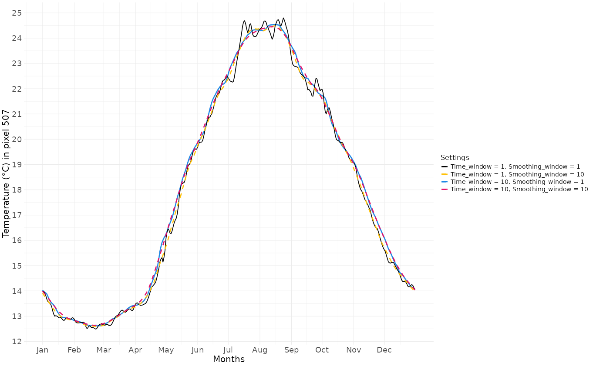

In this pipeline, an extreme event is identified in a given location if the value of the studied parameter exceeds a reference value. This reference value can be fixed over time, as with a biologically defined threshold or an absolute physical limit. Alternatively, it can be derived from the distribution of a historical time series. In this frequentist approach, the threshold is defined as a given percentile of the observed values. For example, if a 90\^th percentile thershold is used, a daily value will be considered as 'extreme' if it is higher than 90 % of the values observed for the same day of the years across all the years that are used as reference. This second approach is commonly used when there are no *a priori* hypotheses about what values constitues an extreme value for the studdied ecosystem, and when the hypothesis is that anything more intense than what the ecosystem is accoustomed to may induce unusual modifications. Alternatively, the mean value observed in the time series can be used to compute a daily baseline value. To proceed accroding to this method, the pipeline involves three steps :\
- First, the baseline value is computed using the *BEE.calc.baseline()* function.\
- Then, each day of the studied time period is compared to the baseline value, and days above (or below) the threshold are identified using *BEE.calc.binarize()*. If you are working with a fixed baseline, you can skip *BEE.calc.baseline()* and go straight to *BEE.calc.binarize()*.\
- Finally, you can apply a filter to *BEE.calc.binarize()* output to add additional criteria to the 'extreme event' definition. This could be a minimum duration or a tolerance of a certain number of days below the baseline value within an extreme event. See *BEE.calc.true_event()*.

# Aims of the function *BEE.calc.baseline()*

*BEE.calc.baseline()* computes the daily baseline value for each day. You can choose the percentile value to use when computing your baseline. Futher along the pipeline, this baseline is used to identify extreme event and compute some metrics about the extreme event.

# Data for this tutorial
copernicus_data_celsius is a spatraster form copernicus, converted from Kelvin to celsius using BEE.calc.celsius(). It has one layer per day between 2023-01-01 and 2025-12-31 and cover around 10 000 km² in the corner of the gulf of lion. See article *0. Download data from Copernicus* for more informations and *0.bis. Convert tempreature data to Celsius*.

# Usage

## Arguments:

**YourSpatraster** is a spatraster with one layer per day. Each layer covers the same area,
and the time series must encompass the start_date and end_date provided as argument.  
**start_date** and **end_date** are the limits of the time period you want to consider has the
reference value to compute the baseline. Please ensure that the date format matches that of the  provided spatraster. You can check the format using terra::time(YourSpatraster).  
**threshold** is the argument specifying whether you want to compute a percentile value of the time
serie or the mean value. Arguments accepted are:  
- *"qt"* (quantile), to calculate a percentile.
- *"mean"*, to calculate the mean value across the time serie.  
**quantile_value** is a numerical argument to specify the value of the quantile you want to compute.
If threshold = "mean", the quantile_value argument will be ignored.  
**time_window** number of days on either side of day 'd' that are used to
calculate the threshold value associated for day 'd'. 
For example, if *"time_window = 5"*, the thershold value for 'd' day will
be calculated using data from five days before day d, day d itself,
and the five days after day d, from all years between *"start_date"* and 
*"end_date"*. See 'Examples' section below to see how it can affect baseline value.  
Warning: this argument is not related to the minimum number of days required to distinguish an 'extreme day' from an 'extreme event'. This will be addressed later in the BEE.calc.true_event() function.
**smooth_window** number of days on either side of day 'd' that are used
to calculate the mean value of the threshold assigned to the 'd' day. 
This allows your threshold value to be smoothed across days. 
For example, if *"smooth_window"* is set to 10 days, the final value on
day 'd' will be the mean of the baseline/thershold values calculated for 
days: d - 10 to d + 10 (eleven values). See 'Examples' section below to see how it can affect baseline value.  


## Warnings:

You will receive a warning if :

 - *"start_date"* and/or *"end_date"* provided are not within the dates of the providid spatraster.
 - *"start_date"* and/or *"end_date"* are in a different format than the dates of the provided spatraster.

## Messages:

You will receive a message if :

 - You have not provided a *"start_date"* and/or an *"end_date"*. The message will informed you about the dates used as default *"start_date"* and/or *"end_date"*.

# Examples  

Calculate the baseline value for each day of a year using the 90^th percentile threshold and
all values between d-5 and d+5. Then smothing over a 15 days period centred on the d day:

```{r, echo = FALSE}
### Load the example dataset in R environement :
file_name <- system.file(file.path("extdata", "copernicus_data_celsius.tiff"),
                                   package = "BioExtremeEvent")
copernicus_data_celsius <- terra::rast(file_name)
```

```{r}
library(BioExtremeEvent)
#### Smoothing over 15 days: # 18s to run
baseline_qt90_smth_15 <- BEE.calc.baseline(YourSpatraster = copernicus_data_celsius,
                                    start_date = "2023-01-01",
                                    end_date = "2025-12-31",
                                    threshold = "qt",
                                    quantile_value = 0.9,
                                    time_window = 5,
                                    smooth_window = 7) #7+1+7=15
```

For a given pixel, it produces a baseline value for each day of the year:  

The shorter the reference time series, the more useful the 'time_window' argument is for dealing with NA days and avoiding distortion of the baseline by a few peaks events.  
The *"smoothing_window"* reduces day-to-day discontinuity. It is particularly useful when time series are short and erratic, but it tends to 'flatten' seasonal steep slopes, peaks and trough.
The following examples illustrate how these two arguments can modify the obtained baseline:  
*For the purpose of this example, baseline is computed on a large spatraster than the one commonly use
in this tutorial. The following arguments are used in all the graphs below:  
- start_date = "1982-01-01"
- end_date = "2010-12-31"
- threshold = "qt"
- quantile_value = 0.9

```{r, echo = FALSE, fig.cap = "Baseline values according combinaisons of *time_window* and *smoothing_window*", fig.align = 'center'}

```

## How to save output:

```{r, eval = FALSE}
terra::writeRaster(baseline_qt90_smth_15, "your_path/data/baseline_qt90_smth_15.tiff")
```
